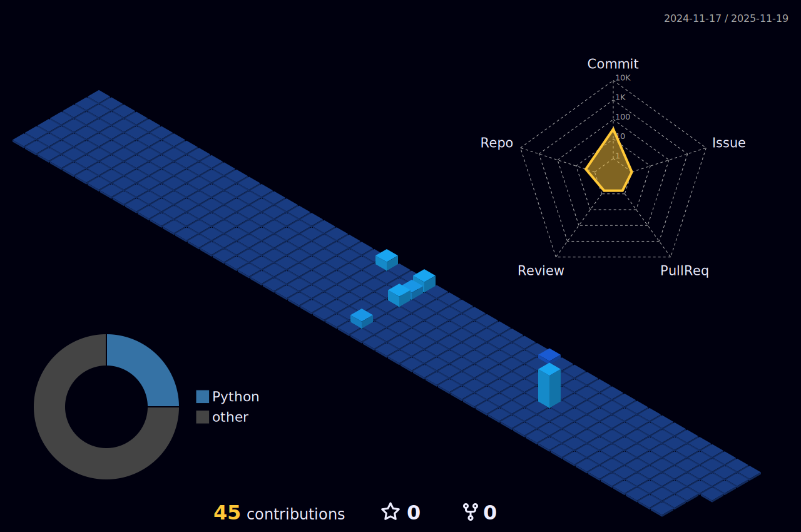

## 

## Facts about me
- 🔭 I’m currently working on QBasic and HTML (CSS, JavaScript, PHP).
- 🌱 I’m currently learning Information Technology.
- 👯 I’m looking to collaborate on anything.
- 🤔 I’m looking for help with Java.
- 💬 Ask me anything about Python.
- 📫 How to reach me: Mail at khurana.akshajt@gmail.com
- 🧑‍🤝‍🧑 My friends are <a href="https://github.com/DibyajyotiBiswal57"> Dibyajyoti</a>, <a href="https://github.com/albert-hawkins-heisenberg"> Aryaman</a>, <a href="https://github.com/UnderRatedCoder05"> Kshitij</a>, <a href="https://github.com/dsdoescreative"> Diptansu</a>.

## My Activity 📊

## A random joke

## A random quote

